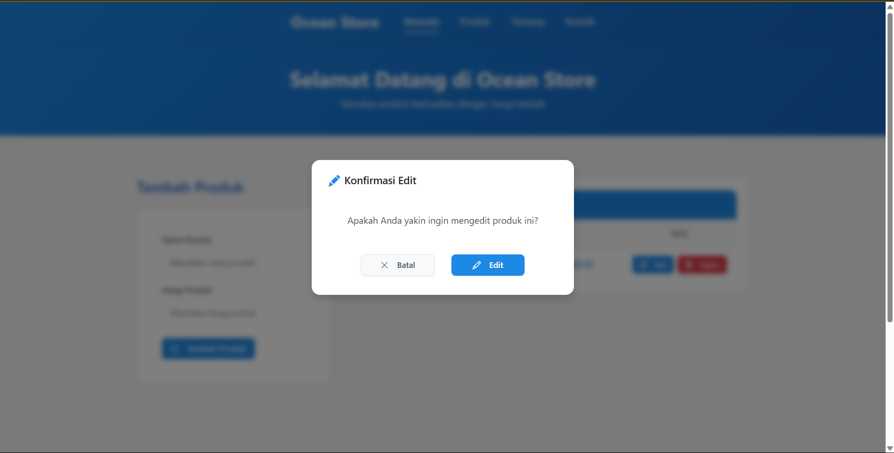

# Laporan Tugas UTS

## Nama: Jonathan Cristopher Jetro (10231047) | Anggots kelompok Lainnya: Gabriel Karmen Sanggalangi (10231039)

## Link Repositori: https://github.com/JoonothanJetr/Proweb

## Link ke README.md: https://github.com/JoonothanJetr/Proweb/blob/main/README.md

## 
1. Manajemen Produk
   - **Menampilkan Daftar Produk**
     - Tampilan tabel responsif dengan kolom: No, Nama Produk, Harga, dan Aksi
     - Sorting otomatis berdasarkan ID secara descending (produk terbaru muncul di atas)
     - Loading state saat memuat data
     - Handling error ketika koneksi backend bermasalah
     - Tampilan kosong ketika belum ada produk

     
   
   - **Menambah Produk Baru**
     - Form input dengan validasi real-time
     - Tombol submit dengan ikon yang intuitif
     - Notifikasi sukses saat produk berhasil ditambahkan
     - Auto-refresh daftar produk setelah penambahan
     - Validasi input sebelum dikirim ke server

     
     
   
   - **Mengedit Produk**
     - Inline editing langsung di dalam tabel
     - Konfirmasi sebelum memulai proses edit dengan modal
     - Tombol Simpan dan Batal saat mode edit aktif
     - Validasi input saat update
     - Notifikasi sukses setelah edit berhasil

     
     
   
   - **Menghapus Produk**
     - Konfirmasi dengan modal dialog sebelum penghapusan
     - Animasi saat produk dihapus dari daftar
     - Notifikasi sukses setelah penghapusan
     - Pembaruan otomatis daftar produk

     
     

2. Validasi Input
   - Validasi nama produk (3-100 karakter)
   - Validasi harga (angka positif)
   - Validasi tombol simpan saat edit
   - Umpan balik "Gagal menambahkan produk" untuk input yang tidak valid

   
   
3. UI/UX
   - **Modal Konfirmasi**
     - Desain modern dengan animasi transisi
     - Fokus yang jelas pada aksi utama
     - Blur effect pada background untuk menonjolkan modal
     - Ikon yang berbeda untuk jenis aksi berbeda (hapus/edit)
   
   - **Notifikasi Toast**
     - Muncul di sudut kanan atas dengan animasi slide
     - Warna berbeda untuk sukses, error, dan warning
     - Auto-dismiss setelah beberapa detik
     - Opsi untuk menutup notifikasi manual
   
   - **Responsive Design**
     - Layout menyesuaikan dengan ukuran layar
     - Mobile-friendly dengan tombol dan form yang mudah digunakan
     - Optimasi text dan elemen visual untuk berbagai ukuran device
   
   - **Loading & Error States**
     - Pesan error
     - Empty state
     - Caching data untuk meminimalkan loading

4. Keamanan
   - Input sanitization untuk mencegah XSS
   - Validasi di frontend dan backend
   - Error handling yang tidak mengekspos informasi sensitif
   - CORS protection untuk mencegah akses tidak sah

## 9. Review Aplikasi Berjalan Tanpa Error
### Frontend
- ✅ React components berfungsi dengan baik
- ✅ Routing berjalan lancar
- ✅ State management berfungsi
- ✅ Form validation bekerja
- ✅ API calls berhasil
- ✅ UI responsive
- ✅ Error handling berfungsi

### Backend
- ✅ Server berjalan tanpa error
- ✅ Database connection stabil
- ✅ API endpoints berfungsi
- ✅ Error handling berjalan
- ✅ CORS berfungsi
- ✅ Input validation bekerja

## 10. Kesimpulan
Aplikasi E-Commerce Proweb telah berhasil dikembangkan dengan memenuhi semua persyaratan fungsional. Aplikasi ini memiliki:
- Antarmuka pengguna yang intuitif
- Validasi input yang baik
- Penanganan error yang efektif
- Performa yang baik
- Keamanan dasar yang memadai

### Langkah Verifikasi
1. Pastikan semua dependensi terinstall
2. Jalankan backend terlebih dahulu
3. Jalankan frontend
4. Periksa console browser untuk error
5. Periksa terminal untuk error server 