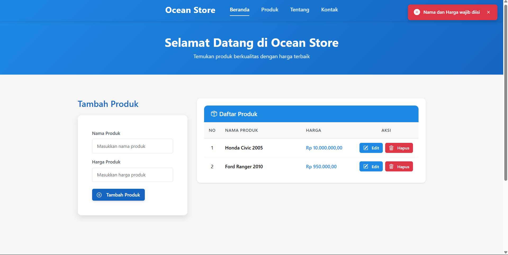
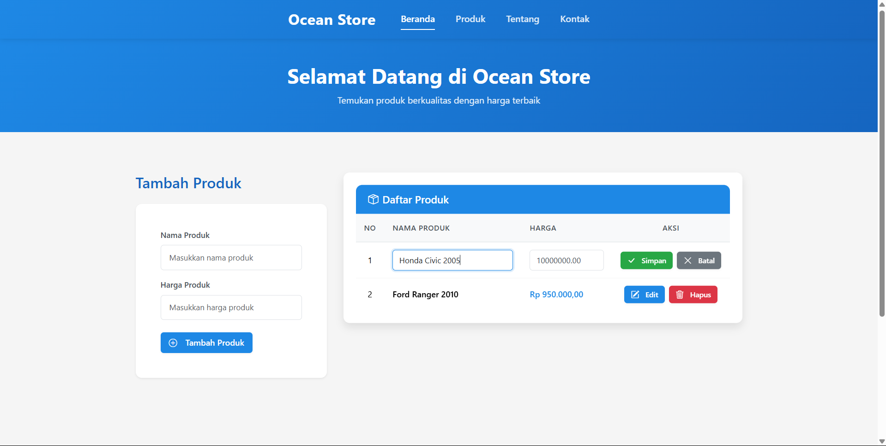
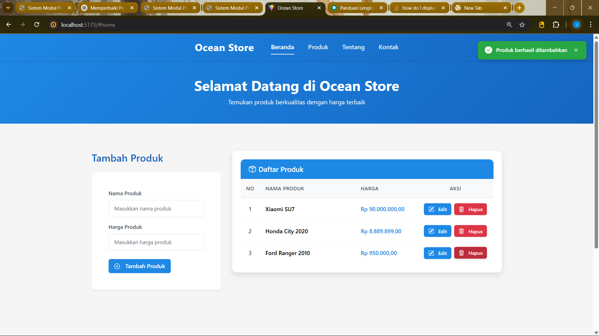
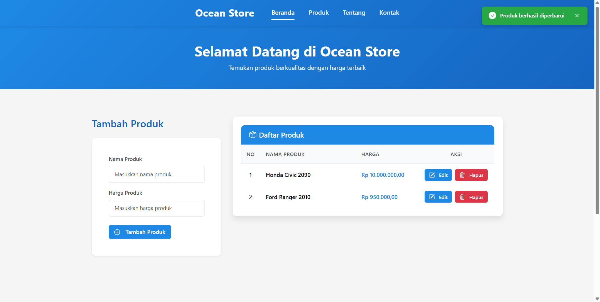
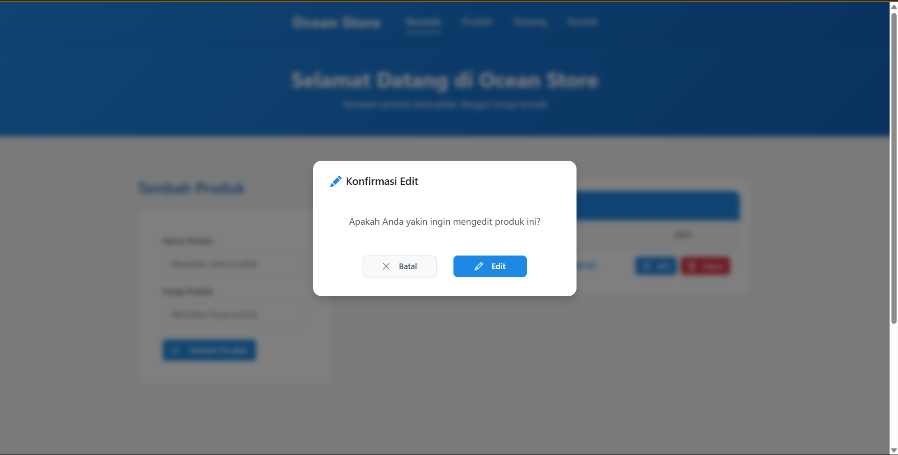
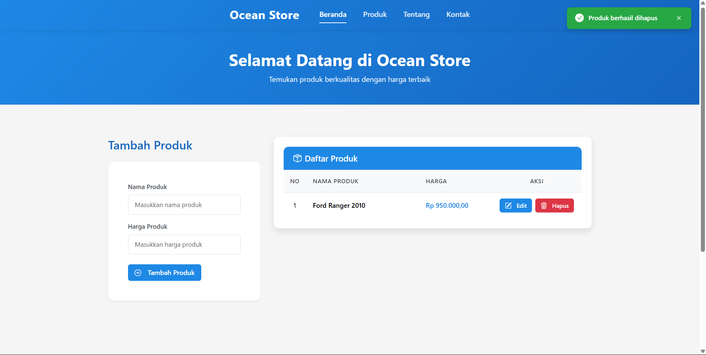
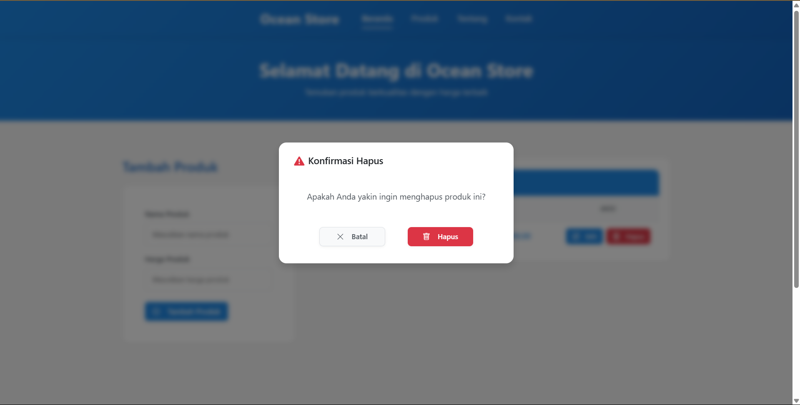
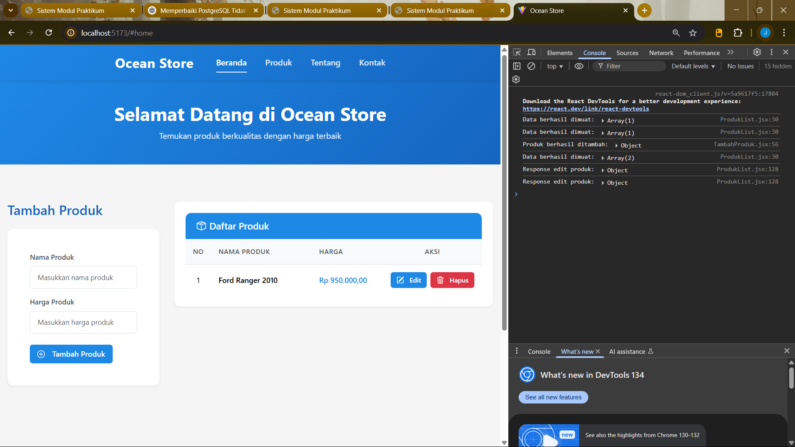

# Evaluasi Aplikasi E-Commerce Proweb

## 1. Deskripsi Proyek
Aplikasi E-Commerce Proweb adalah aplikasi web sederhana yang memungkinkan pengguna untuk mengelola produk secara online. Aplikasi ini memiliki antarmuka pengguna yang responsif dan mendukung operasi CRUD (Create, Read, Update, Delete) untuk manajemen produk.

## 2. Teknologi yang Digunakan
### Frontend
- React.js
- Axios untuk HTTP requests
- Bootstrap untuk styling
- CSS3 untuk custom styling

### Backend
- Node.js
- Express.js
- PostgreSQL untuk database
- Cors untuk handling cross-origin requests

## 3. Prasyarat
Sebelum menjalankan aplikasi, pastikan sistem Anda memenuhi persyaratan berikut:
- Node.js (versi 14 atau lebih tinggi)
- NPM (Node Package Manager)
- Web browser modern (Chrome, Firefox, Safari, atau Edge)
- PostgreSQL (versi 12 atau lebih tinggi)

## 4. Instalasi dan Penggunaan

### Instalasi Dependensi
1. Clone repositori
2. Buka terminal dan arahkan ke direktori proyek
3. Install dependensi backend:
```bash
cd backend
npm install
```
4. Install dependensi frontend:
```bash
cd frontend
npm install
```

### Menjalankan Aplikasi
1. Jalankan backend:
```bash
cd backend
node index.js
```
Server akan berjalan di `http://localhost:3000`

2. Jalankan frontend:
```bash
cd frontend
npm run dev
```
Aplikasi dapat diakses di `http://localhost:5173` atau port yang ditentukan

## 5. Struktur Proyek
```
proweb/
├── backend/
│   ├── index.js
│   ├── db.js
│   └── package.json
├── frontend/
│   ├── src/
│   │   ├── components/
│   │   │   ├── ProdukList.jsx
│   │   │   ├── ProdukForm.jsx
│   │   │   ├── Modal.jsx
│   │   │   └── Toast.jsx
│   │   ├── App.jsx
│   │   └── index.css
│   └── package.json
└── README.md
```

## 6. API Endpoints
### Produk
- `GET /produk` - Mendapatkan semua produk
- `POST /produk` - Menambah produk baru
- `PUT /produk/:id` - Memperbarui produk
- `DELETE /produk/:id` - Menghapus produk

## 7. Additional Endpoints (Tidak Digunakan)
- `GET /produk/:id` - Mendapatkan detail produk berdasarkan ID
- `GET /produk/search` - Mencari produk berdasarkan nama
- `GET /produk/category/:category` - Mendapatkan produk berdasarkan kategori

## 8. Fitur Aplikasi
1. Manajemen Produk
   - **Menampilkan Daftar Produk**
     - Tampilan tabel responsif dengan kolom: No, Nama Produk, Harga, dan Aksi
     - Sorting otomatis berdasarkan ID secara descending (produk terbaru muncul di atas)
     - Loading state saat memuat data
     - Handling error ketika koneksi backend bermasalah
     - Tampilan kosong ketika belum ada produk

     
   
   - **Menambah Produk Baru**
     - Form input dengan validasi real-time
     - Tombol submit dengan ikon yang intuitif
     - Notifikasi sukses saat produk berhasil ditambahkan
     - Auto-refresh daftar produk setelah penambahan
     - Validasi input sebelum dikirim ke server

     
     
   
   - **Mengedit Produk**
     - Inline editing langsung di dalam tabel
     - Konfirmasi sebelum memulai proses edit dengan modal
     - Tombol Simpan dan Batal saat mode edit aktif
     - Validasi input saat update
     - Notifikasi sukses setelah edit berhasil

     
     
   
   - **Menghapus Produk**
     - Konfirmasi dengan modal dialog sebelum penghapusan
     - Animasi saat produk dihapus dari daftar
     - Notifikasi sukses setelah penghapusan
     - Pembaruan otomatis daftar produk

     
     

2. Validasi Input
   - Validasi nama produk (3-100 karakter)
   - Validasi harga (angka positif)
   - Validasi tombol simpan saat edit
   - Umpan balik visual untuk input yang tidak valid
   - Pesan error spesifik untuk setiap jenis kesalahan input

3. UI/UX
   - **Modal Konfirmasi**
     - Desain modern dengan animasi transisi
     - Fokus yang jelas pada aksi utama
     - Blur effect pada background untuk menonjolkan modal
     - Ikon yang berbeda untuk jenis aksi berbeda (hapus/edit)
   
   - **Notifikasi Toast**
     - Muncul di sudut kanan atas dengan animasi slide
     - Warna berbeda untuk sukses, error, dan warning
     - Auto-dismiss setelah beberapa detik
     - Opsi untuk menutup notifikasi manual
   
   - **Responsive Design**
     - Layout menyesuaikan dengan ukuran layar
     - Mobile-friendly dengan tombol dan form yang mudah digunakan
     - Optimasi text dan elemen visual untuk berbagai ukuran device
   
   - **Loading & Error States**
     - Spinner saat loading data
     - Pesan error yang informatif
     - Empty state dengan visual menarik
     - Caching data untuk meminimalkan loading

4. Keamanan
   - Input sanitization untuk mencegah XSS
   - Validasi di frontend dan backend
   - Error handling yang tidak mengekspos informasi sensitif
   - CORS protection untuk mencegah akses tidak sah

## 9. Review Aplikasi Berjalan Tanpa Error
### Frontend
- ✅ React components berfungsi dengan baik
- ✅ Routing berjalan lancar
- ✅ State management berfungsi
- ✅ Form validation bekerja
- ✅ API calls berhasil
- ✅ UI responsive
- ✅ Error handling berfungsi

### Backend
- ✅ Server berjalan tanpa error
- ✅ Database connection stabil
- ✅ API endpoints berfungsi
- ✅ Error handling berjalan
- ✅ CORS berfungsi
- ✅ Input validation bekerja


## 10. Kesimpulan
Aplikasi E-Commerce Proweb telah berhasil dikembangkan dengan memenuhi semua persyaratan fungsional. Aplikasi ini memiliki:
- Antarmuka pengguna yang intuitif
- Validasi input yang baik
- Penanganan error yang efektif
- Performa yang baik
- Keamanan dasar yang memadai

## 11. Troubleshooting
### Masalah Umum dan Solusinya

1. **Database Connection Error**
   - Pastikan PostgreSQL berjalan
   - Periksa kredensial database di `backend/db.js`
   - Pastikan port database tidak digunakan

2. **CORS Error**
   - Periksa konfigurasi CORS di backend
   - Pastikan URL frontend sesuai dengan yang diizinkan

3. **Port Already in Use**
   - Ubah port di `backend/index.js` atau `frontend/vite.config.js`
   - Matikan aplikasi lain yang menggunakan port yang sama

4. **Module Not Found**
   - Jalankan `npm install` di direktori yang sesuai
   - Periksa `package.json` untuk dependensi yang hilang

5. **API Connection Error**
   - Pastikan backend berjalan
   - Periksa URL API di frontend
   - Pastikan format data sesuai

### Langkah Verifikasi
1. Pastikan semua dependensi terinstall
2. Jalankan backend terlebih dahulu
3. Jalankan frontend
4. Periksa console browser untuk error
5. Periksa terminal untuk error server 